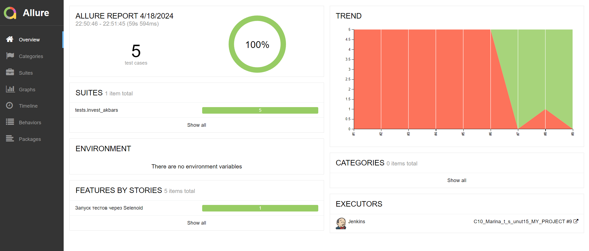

# Проект по тестированию сайта [invest.akbars.ru](https://invest.akbars.ru/) - цифровые инвестиционные продукты:
- ИИС
- БС
- ПИФы
- Доверительное управление
----
> Открытие инвест-продуктов  

> Пополнение

----

## Список проверок, реализованных в автотестах:

### UI автотесты:

- [x] Переход к форме открытия счёта (ИИС\БС\ДУ) и открытие в шаге 1 статичных документов (2 документа)
- [x] в шаге 1 заполнение обязательных полей и переход к следующему шагу
- [x] В шаге 1 попытка перейти к следующему шагу не заполнив поля
- [x] в шаге 2 заполнение обязательных полей и переход к следующему шагу
- [x] в шаге 3 - поля по умолчанию и переход к шагу 4

----

### Проект реализован с использованием:

<image width="24px" title="python" src="https://github.com/temirkhanovams/temirkhanovams/tree/main/icons/python.png" />

<p align="left">
<image width="24px" title="python" src="../main/icons/python.png" />
</p>


 
  


> Для полноценного прохождения всех тестов необходимо в шаге 4 ввести код, полученный в смс - это ручной тест.
`.env`
>
Для написания UI-тестов используется фреймворк `Selene`, современная «обёртка» вокруг `Selenium WebDriver`
Библиотека модульного тестирования: `PyTest`  
`Jenkins` выполняет удаленный запуск тестов в графическом интерфейсе. Установки дополнительных приложений на компьютер
пользователя не требуется.  
`Selenoid` запускает браузер с тестами в контейнерах `Docker` (и записывает видео)  
Фреймворк `Allure Report` собирает графический отчет о прохождении тестов  
После завершения тестов `Telegram Bot` отправляет в `Telegram` краткий вариант `Allure Report`

----

### Локальный запуск

Необходимо создать файл `.env` и заполнить его актуальными тестовыми параметрами.

1) Скачать проект и открыть в IDE
2) Для локального запуска необходимо выполнить команду в терминале:

Запустить все тесты через консоль, если настроен pytest.ini

```commandline
pytest
```
или
```commandline
pytest .\tests\invest_akbars\ 
```
Запустить все тесты, если в pytest.ini не указаны параметры папки и параметры удаления
```commandline
pytest --clean-alluredir --alluredir=allure-results
```
Сгенерировать allure-отчёт (локальный) - Windows в корне проекта в папке allure-results
```commandline
allure.bat serve allure-results
```
или без указания папки
```commandline
allure.bat serve
```

Результат: откроется web-страница с отчетом Allure Report

----

###  Удаленный запуск автотестов выполняется на сервере Jenkins

> <a target="_blank" href="https://jenkins.autotests.cloud/job/C10_Marina_t_s_unut15_MY_PROJECT">Ссылка на проект в
> Jenkins</a>

----


#### Для запуска автотестов в Jenkins

1. Открыть <a target="_blank" href="https://jenkins.autotests.cloud/job/C10_Marina_t_s_unut15_MY_PROJECT">проект</a>
2. Выбрать пункт `Build with Parameters`
3. Выбрать браузер
4. Выбрать версию браузера
4. Указать комментарий для уведомления в Телеграмм
5. Нажать кнопку `Build`
6. Результат запуска сборки можно посмотреть в отчёте Allure


----
###  Allure отчет


Отчет позволяет получить детальную информацию по всем шагам тестов, включая скриншоты и log - файлы


###  Видео прохождения теста:

Видеозапись каждого теста генерируется с помощью `Selenoid` после успешного запуска контейнера c тестами в `Docker`.


###  Получение уведомлений о прохождении тестов в Telegram

После завершения сборки специальный Telegram-бот отправляет сообщение с отчетом.


