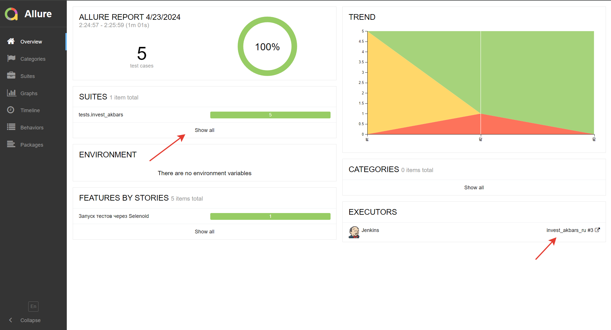
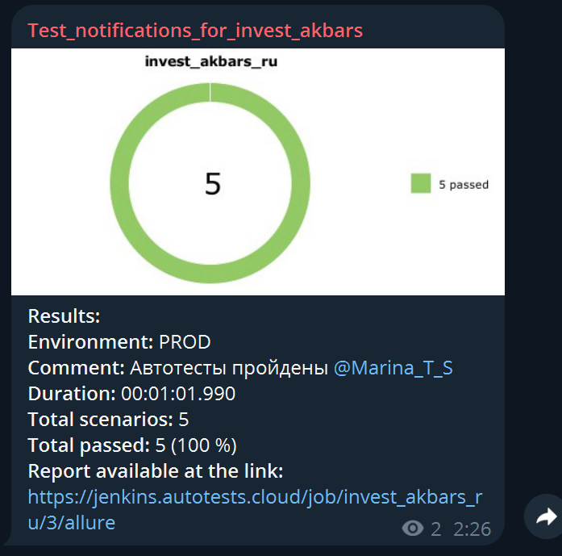
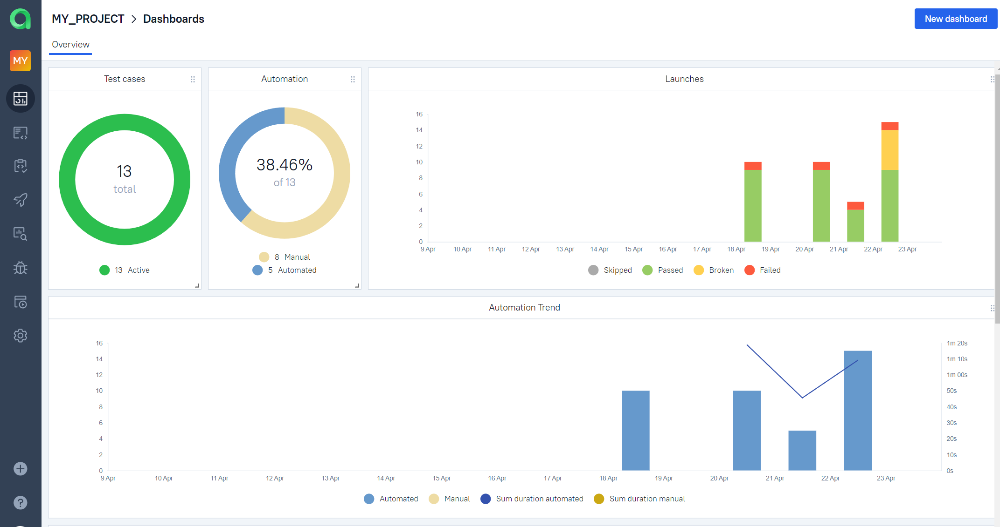
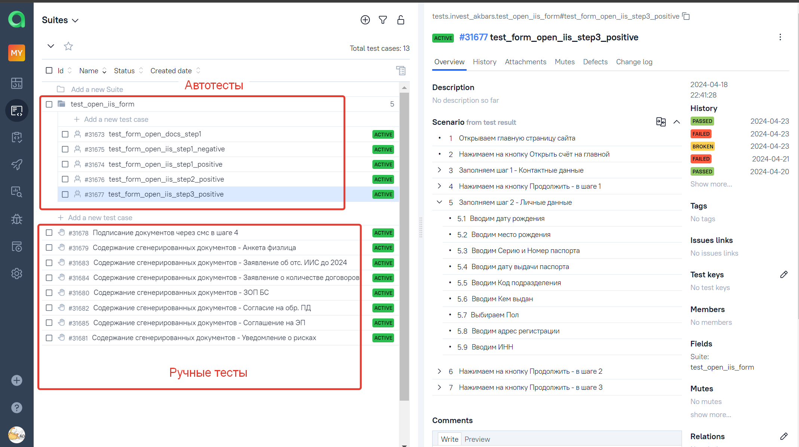
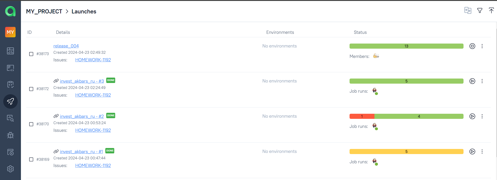
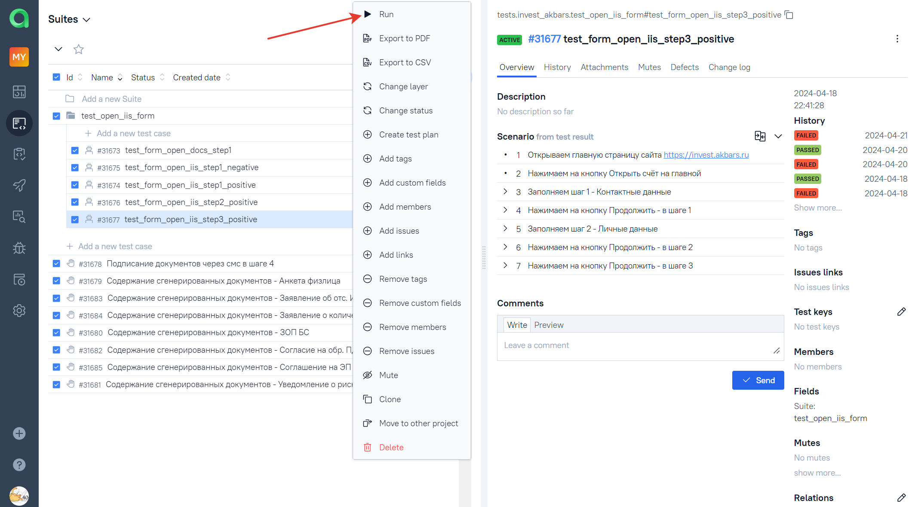
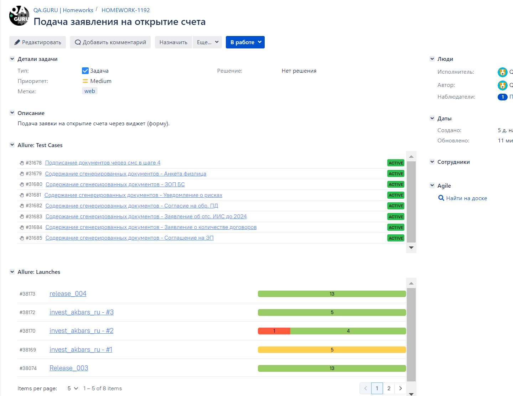
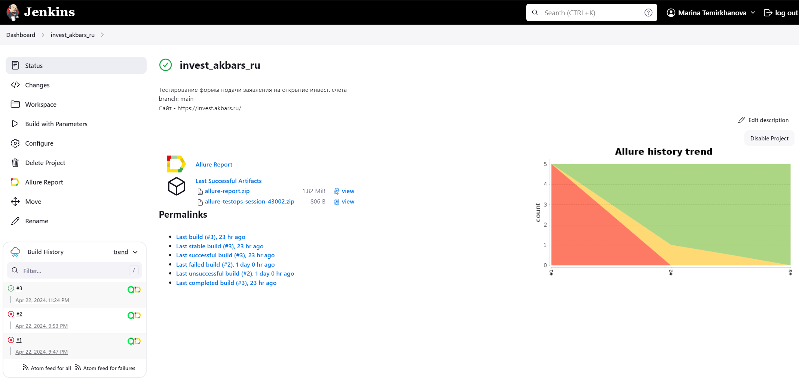
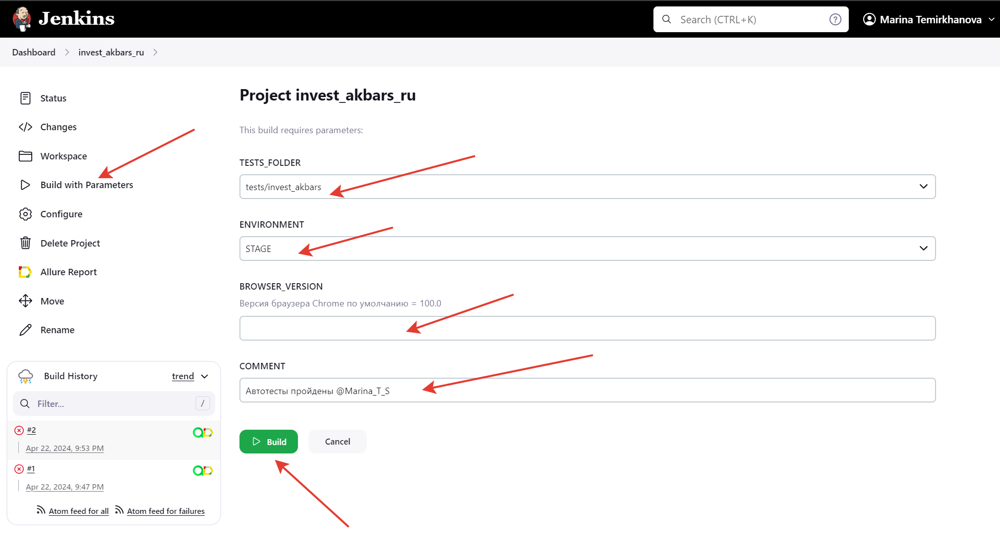
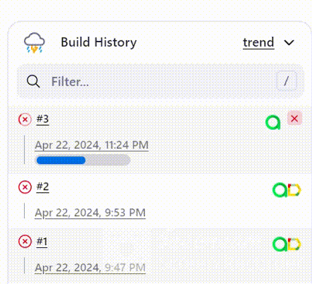

# Проект по тестированию сайта [invest.akbars.ru](https://invest.akbars.ru/)
> ИИС, БС, ПИФы и Доверительное управление
----
В проекте реализованы автотесты и ручные тесты, которые заполняют форму открытия счёта.  
Данная форма состоит из 4 шагов:
1) Контактные данные
2) Личные данные
3) Выбор продукта
4) Подписание документов

### Проект реализован с использованием:  


  

___
Для написания UI-тестов используется фреймворк `Selene`, современная «обёртка» вокруг `Selenium WebDriver`, паттерн `PageObject`.  
Библиотека модульного тестирования: `PyTest`  
`Jenkins` выполняет удаленный запуск тестов в графическом интерфейсе. Установки дополнительных приложений на компьютер
пользователя не требуется.  
`Selenoid` запускает браузер с тестами (и записывает видео)  
Фреймворк `Allure Report` собирает графический отчет о прохождении тестов  
После завершения тестов `Telegram Bot` отправляет в `Telegram` краткий вариант `Allure Report`
----

###  Allure отчет по автотестам  
[Report in Allure](https://jenkins.autotests.cloud/job/C10_Marina_t_s_unut15_MY_PROJECT/11/allure/#suites/f060e8ca884180d3ef8856f59eb3c0d5/3ed5e72d9f0c075/)  
  


> Отчет позволяет получить детальную информацию по всем шагам тестов, включая скриншоты и log - файлы

####  Видео прохождения теста:

>Видеозапись каждого теста генерируется с помощью `Selenoid` после успешного запуска тестов.


###  Получение уведомлений о прохождении тестов в Telegram

> После завершения сборки специальный Telegram-бот отправляет сообщение с отчетом.



###  Интеграция с Allure TestOps
[Dashboards AllureTestOps](https://allure.autotests.cloud/project/4179/dashboards)  
> Так же вся отчетность сохраняется в Allure TestOps, где строятся аналогичные графики.  

 

TestOps также позволяет:
- Добавлять к [Suite AllureTestOps](https://allure.autotests.cloud/project/4179/test-cases?treeId=8184)   ручные тесты 
- Управлять всеми тест-кейсами или с каждым отдельно
- Перезапускать каждый тест отдельно от всех тестов
- Настроить интеграцию с Jira и др.  

Автотесты, которые подтянулись в `AllureTestOps` из `Jenkins`. И ручные тесты, которые созданы в самом `Allure TestOps`  

 

[Тест-раны в AllureTestOps](https://allure.autotests.cloud/project/4179/launches)
- Здесь видим ран, который был запущен через Jenkins. Он с автотестами `invest_akbars_ru - #3`
- И Run с автотестами и ручными тестами `release_004`, который был собран вручную в `AllureTestOps`. 

 

`AllureTestOps`, будучи системой управления тестами, позволяет запускать тест-раны, и выполнять всевозможные манипуляции с ручными тестами.  
 

---

###  Интеграция с Jira
[Jira issue](https://jira.autotests.cloud/browse/HOMEWORK-1192)  
Настроив через `Allure TestOps` интеграцию с `Jira`, [в задаче](https://jira.autotests.cloud/browse/HOMEWORK-1192) можно интегрировать результаты прохождения тестов и список тест-кейсов из `AllureTestOps`.  
А также после прохождения ручных и автотестов создать Release в `AllureTestOps`, и интегрировать его результаты тоже.  

> В задаче Jira интегрированы результаты прохождения тест-ранов из `AllureTestOps`, а также список тестов, относящихся к данной задаче.

 

----

##  Удаленный запуск автотестов  
- Выполняется на сервере Jenkins
> <a target="_blank" href="https://jenkins.autotests.cloud/job/invest_akbars_ru/">Ссылка на проект в Jenkins</a>
----
### Для запуска автотестов в Jenkins  
1. Открыть <a target="_blank" href="https://jenkins.autotests.cloud/job/invest_akbars_ru/">проект в Jenkins (job)</a>
2. Выбрать пункт `Build with Parameters`
3. Выбрать браузер
4. Выбрать версию браузера
5. Указать комментарий для уведомления в Телеграмм
6. Нажать кнопку `Build`
7. Результат запуска сборки можно посмотреть в отчёте Allure  
---
### Проект в Jenkins  
[Проект в Jenkins](https://jenkins.autotests.cloud/job/invest_akbars_ru/)

### Параметры запуска билда в Jenkins  
- Либо с параметрами по умолчанию
- Либо указать свои параметры

  

После этого запустится билд, а после его выполнения рядом появятся иконки для просмотра отчётов в Allure и AllureTestOps  




----

## Локальный запуск
Ветка на github: [for_allure_in_local](https://github.com/temirkhanovams/qa_guru_project_homework_15/blob/for_allure_in_local)

1) Скачать проект и открыть в IDE
Необходимо создать в корне проекта файл `.env` и заполнить его актуальными тестовыми параметрами:  
`LOGIN="***"`  
`PASSWORD="***"`  
2) Для локального запуска необходимо выполнить команду в терминале:  
   - [x] Запустить все тесты через консоль, если настроен pytest.ini (указана папка для хранения отчетов)  
      ```commandline
      pytest
      ```
      или
      ```commandline
      pytest .\tests\invest_akbars\
      ```
   - [x] Запустить все тесты, если в pytest.ini не указаны параметры папки и параметры удаления
      ```commandline
      pytest --clean-alluredir --alluredir=allure-results
      ```
   - [x] Запустить определённый тест отдельно:  
      ```commandline
      pytest .\tests\invest_akbars\test_open_iis_form.py::test_form_open_iis_step3_positive
      ```
3) Сгенерировать allure-отчёт (локальный) - Windows в корне проекта в папке allure-results
```commandline
allure.bat serve allure-results
```
или без указания папки (он указан в файле pytest.ini)
```commandline
allure.bat serve
```

4) Результат: откроется web-страница с отчетом Allure Report

----